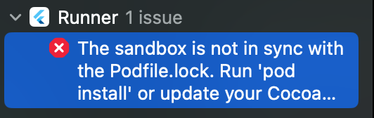
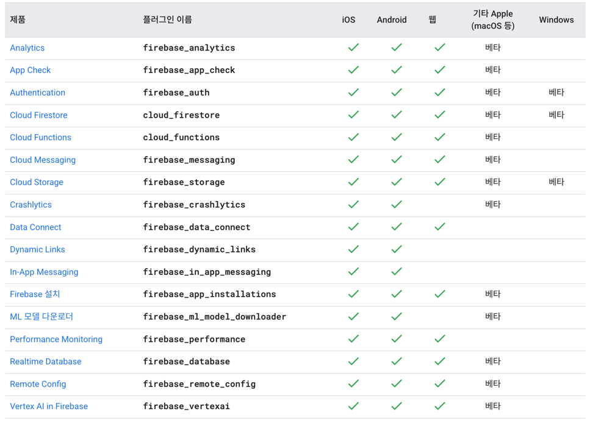

# tiktok

nomadcoders tiktok clone coding project

Flutter Android license 적용

```shell
flutter doctor --android-licenses
```

## 16 Intl

### 16.4 Flutter Intl

`Flutter Intl` plugin 을 사용하여 간단하게 프로젝트에서 Intl 을 사용할 수 있음

- `intellij` 기준 `shift + shift` 입력 시 `flutter intl` 검색
- `Flutter Intl` 을 실행하여 프로젝트를 초기화
- 필요한 Locale 에 대하여 `Add Locale` 을 통해 추가

```dart
@override
Widget build(BuildContext context) {
  return MaterialApp(
    localizationsDelegates: [
      S.delegate,
      GlobalMaterialLocalizations.delegate,
      GlobalCupertinoLocalizations.delegate,
      GlobalWidgetsLocalizations.delegate,
    ],
    supportedLocales: [
      Locale("en"),
      Locale("kr"),
      Locale("es"),
    ],
  );
}
```

### 16.6 Numbers l10n

intl 파일에서 사용가능한 `format` 형식
https://docs.flutter.dev/ui/accessibility-and-internationalization/internationalization#messages-with-numbers-and-currencies

### 16.7 Date l10n

intl 파일에서 사용 가능한 다양한 `DateTime` format
https://api.flutter.dev/flutter/intl/DateFormat-class.html

## 18 NAVIGATOR 2

flutter 에서 `named route` 는 지양되고 있음

- https://docs.flutter.dev/cookbook/navigation/named-routes
- browser 환경에서 `forward`가 동작하지 않음

### GoRouter

https://pub.dev/packages/go_router/install

## 19 VIDEO RECORDING

> ## Iphone Build App Error
> 
> `cd ./ios`
> `rm -rf Pods`  
> `rm -rf Podfile.lock`  
> `pod install`  
> `xcode` => `shift + command + K`

### 앱 빌드를 위한 아이폰 세팅

1. `ios/Runner/Info.plist`
2. `ios/Podfile`

위의 파일 수정을 통해 카메라 및 마이크 권한 부여 설정

### 앱 빌드를 위한 안드로이드 세팅

1. `android/gradle.properties`

    ```
    android.useAndroidX=true
    android.enableJetifier=true
    ```

2. `android/app/build.gradle`

    ```
    android {
      compileSdkVersion 33
      ...
    }
    ```

> `exportSyncFdForQSRILocked` 로그가 지속적으로 발생하는 경우
> `flutter run --no-enable-impeller`  또는
> Edit Configuration 에서 `Additional run args` 에
> `--no-enable-impeller` 옵션 추가

## 22. Firebase Setup

https://firebase.google.com/docs/flutter/setup

### 23.1 Installation

1. Install Firebase-Cli
   ```shell
   curl -sL https://firebase.tools | bash
   ```
2. Firebase login
   ```shell
   firebase login
   ```
3. Install the `FlutterFire CLI`
   ```shell
   dart pub global activate flutterfire_cli
   ```
4. Configure your apps to use Firebase

   > zsh: command not found: flutterfire  
   > 위와 같은 오류 발생시  
   > `vi ~/.zshrc`  
   > 맨 아래에 `export PATH="$PATH:$HOME/.pub-cache/bin"` 추가  
   > `source ~/.zshrc`

   ```shell
   flutter-proj$ flutterfire configure
   ```
    - firebase 플러그인을 추가/제거할 때마다 위의 명령을 실행해 주어야 함.



- https://firebase.google.com/docs/flutter/setup

## 24 FIREBASE AUTHENTICATION

### 24.3 Social Auth Config

- Android 의 경우 세팅

1. `./gradlew signinReport` 콘솔에 입력